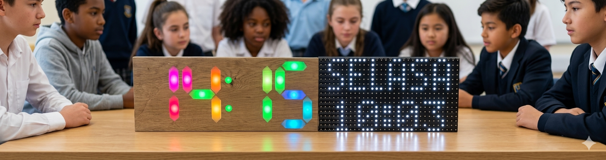

# JWS
Smart JWS - SMK Electronics Edition

  

# 🕋 Smart JWS - SMK Electronics Edition
**Sistem Jam Waktu Sholat Berbasis Dual-ESP8266 (Master-Slave)**

Proyek ini adalah sistem Jam Waktu Sholat (JWS) canggih yang memisahkan beban kerja menggunakan dua mikrokontroler. Master menangani perhitungan waktu dan WiFi, sementara Slave fokus pada tampilan visual LED Matrix P10.

---

## 🚀 Fitur Unggulan
* **Dual-Core Architecture:** Sinkronisasi data via Serial (Master-Slave) untuk menghindari lag pada tampilan LED.
* **Audio Queue System:** Tarhim otomatis (10 mnt sebelum adzan) dan Adzan yang diikuti Doa secara berurutan.
* **Auto-Location:** Sinkronisasi lokasi (Lat/Lon) otomatis via internet.
* **Smart Brightness:** Panel meredup otomatis (jam 22.00 - 04.00) untuk kenyamanan dan hemat energi.
* **Web Control Interface:** Pengaturan WiFi, Pesan, Volume, dan Jadwal melalui HP (IP: 192.168.4.1).
* **Memory Persistent:** Pesan yang diinput dari HP tersimpan aman di EEPROM Slave.

---

## 🔌 Skema Koneksi Pin

### 1. Master Unit (Wemos D1 Mini)
| Komponen | Pin Wemos | Keterangan |
| :--- | :--- | :--- |
| **RTC DS3231** | D2 (SDA), D1 (SCL) | Waktu Presisi |
| **DFPlayer** | D7 (TX), D5 (RX) | Modul MP3 |
| **Data Out** | **TX** | Kirim ke RX Slave |
| **Power** | 5V & GND | Sumber Daya |

### 2. Slave Unit (ESP8266)
| Komponen | Pin ESP | Keterangan |
| :--- | :--- | :--- |
| **Data In** | **RX** | Terima dari TX Master |
| **Panel P10** | D5, D7, D8, D1, D2 | Jalur Data DMD |
| **Power** | 5V & GND | Sumber Daya |

---

## 📂 Manajemen File Audio (SD Card)
Simpan file MP3 di dalam folder bernama `mp3` dengan format nama berikut:
1.  `0001.mp3` : Audio Tarhim (Sholawat)
2.  `0002.mp3` : Audio Adzan
3.  `0003.mp3` : Doa Setelah Adzan

---

## 🛠️ Cara Penggunaan
1.  **Instalasi:** Hubungkan Master dan Slave melalui kabel Serial (TX ke RX). Pastikan GND kedua Wemos terhubung.
2.  **Koneksi:** Hubungkan HP ke WiFi bernama **"JWS-CONFIG"** (Password: `12345678`).
3.  **Konfigurasi:** Buka browser dan ketik `192.168.4.1`.
4.  **Update:** Masukkan pesan, atur volume, dan simpan. Sistem akan langsung memperbarui tampilan panel.

---

## 📝 Catatan Teknis
* **Baudrate:** Master dan Slave disetel pada kecepatan `9600 bps`.
* **Power:** Gunakan Power Supply minimal **5V 5A** jika menggunakan lebih dari 1 panel P10.
* **Upload:** Lepas kabel TX/RX saat proses upload sketch agar tidak terjadi error komunikasi.

---

# 🛠️ Alur Logika JWS (Master & Slave)

### 1. Master Logic (ESP8266 + Jam Pixel)
Sistem utama yang mengatur perhitungan waktu, audio, dan pengiriman data serial.

* **Proses Inti:** `Update Waktu (RTC/NTP)` --> `Hitung Jadwal Sholat` --> `Cek Waktu (Tarhim/Adzan/Iqomah)` --> `Kirim Data ke Slave` --> `Loop Motivasi`.

* **Hirarki Prioritas:**
    * **Prioritas 1 (Adzan):** Saat jam sholat tiba, Master mengirim perintah `<CONFIG,MSG,WAKTU ... TIBA>` dan memicu MP3 Adzan.
    * **Prioritas 2 (Iqomah):** Mengirim data hitungan mundur `<CONFIG,TYPE,IQOMAH MM:SS>` secara kontinu.
    * **Prioritas 3 (Normal):** Mengirim paket data Jam/Jadwal rutin dan pesan motivasi acak setiap **10 menit**.

---

### 2. Slave Logic (ESP8266 + Panel P10)
Unit display yang memproses data serial dan mengatur antrean tampilan panel.

* **Proses Inti:** `Terima Data Serial` --> `Filter Validasi (Jam vs Isi Pesan)` --> `Update Tampilan (Urutan 0-3)`.

* **Mekanisme Filter:** Mengecek validitas pesan info sholat. Jika pesan mengandung kata "WAKTU" namun jam tidak sesuai dengan jadwal sholat, pesan akan diabaikan untuk mencegah data "salah alamat".

---

### 3. Siklus Tampilan Slave (Loop Display)
Slave membagi tampilan ke dalam dua siklus antrean agar informasi seimbang.

| Urutan | Mode Tampilan | Siklus A (Gilir Pesan HP) | Siklus B (Gilir Motivasi) |
| :--- | :--- | :--- | :--- |
| **0** | **Jam Besar** | Jam Digital format Big Number (7 detik) | Jam Digital format Big Number (7 detik) |
| **1** | **Kalender** | Animasi Slide Hari dan Tanggal | Animasi Slide Hari dan Tanggal |
| **2** | **Jadwal** | Daftar 6 Waktu Sholat (Typewriter) | Daftar 6 Waktu Sholat (Typewriter) |
| **3** | **Running Text** | **Pesan Utama dari HP (User)** | **Pesan Motivasi dari Master** |

---

### 4. Ringkasan Komunikasi Serial
* **Baudrate:** 9600 bps.
* **Format Data:** `<H,M,S,Tgl,Bln,Thn,Imsak,Subuh,Dzuhur,Ashar,Magrib,Isya*Checksum>`.
* **Trigger Command:** * `CONFIG,BRIGHT` (Kecerahan)
    * `CONFIG,TYPE` (Pesan Otomatis/Iqomah)
    * `CONFIG,MSG` (Pesan User)

---

**Developed by SMK Electronics - 2026**
